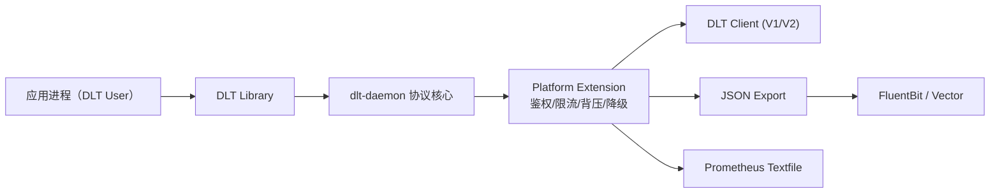

# 车机日志平台 / Cockpit Logging Platform（COVESA DLT 增强版）

🔥 面向车机与座舱场景的日志平台工程化实现。  
🚀 基于 `COVESA dlt-daemon`，在不破坏协议行为的前提下补齐安全、运维、观测与交付能力。  
⭐ 覆盖 AUTOSAR DLT V1/V2 兼容回归、应用级限流、背压保护、JSON 导出、Prometheus 指标、FluentBit/Vector 桥接、ARM 与 Yocto 交付链路。

<p align="center">
  
  
  
  
</p>

---

## 目录

- [1. 项目概述](#1-项目概述)
- [2. 改造目标与设计原则](#2-改造目标与设计原则)
- [3. 平台能力全景](#3-平台能力全景)
- [4. 架构设计说明](#4-架构设计说明)
- [5. 配置体系](#5-配置体系)
- [6. 构建与运行](#6-构建与运行)
- [7. 运维与故障处理流程](#7-运维与故障处理流程)
- [8. 测试与发布门禁](#8-测试与发布门禁)
- [9. 交付与打包体系](#9-交付与打包体系)
- [10. 仓库结构](#10-仓库结构)
- [11. 合规与许可证](#11-合规与许可证)
- [12. 路线图](#12-路线图)
- [13. 常见问题](#13-常见问题)
- [14. 贡献说明](#14-贡献说明)

---

## 1. 项目概述

本仓库将 `dlt-daemon` 定位为“车机日志平台底座”而非单一日志进程，核心关注点是：在保留 DLT 协议兼容性的同时，让系统满足真实车载项目中的可部署、可治理、可回归、可演进要求。

相比仅具备基础收发能力的形态，本项目强调四件事：

1. **协议稳定性**：AUTOSAR V1/V2 行为不被改写。
2. **平台治理能力**：鉴权、限流、背压、降级等策略可配置。
3. **可观测与可运维**：结构化导出、指标导出、健康检查、故障流程。
4. **可交付性**：CI 发布门禁、ARM 交叉编译、Yocto 配方、systemd 模板。

适用场景：

- 车机主控日志汇聚与远程采集；
- 多应用高并发日志写入场景；
- 云边日志通道需要标准化桥接（FluentBit/Vector）；
- 需要把日志组件纳入持续发布与系统镜像构建体系的团队。

---

## 2. 改造目标与设计原则

### 2.1 改造目标

- 保持 DLT 协议兼容（V1/V2）。
- 先改配置层，再改核心路径，降低改造风险。
- 将外部地址、缓存策略、日志路径全部参数化。
- 提供控制命令鉴权与应用级配额限流能力。
- 提供背压与异常降级策略，提升高峰稳定性。
- 增加结构化输出与统一观测接入能力。

### 2.2 设计原则

1. **默认不改变行为**：新增能力全部为 opt-in，默认关闭。
2. **旁路策略模块化**：业务治理逻辑放独立模块，核心协议路径保持清晰。
3. **先可回归再可扩展**：发布必须通过协议兼容回归门禁。
4. **配置驱动而非硬编码**：运行策略通过 `dlt.conf` 管理。

---

## 3. 平台能力全景

### 3.1 协议与核心行为

- 保持标准 DLT V1/V2 编解码语义；
- 保留既有控制消息与日志路径；
- 增强逻辑通过独立模块挂接，避免侵入式重写。

### 3.2 安全与控制

- 控制命令鉴权：
  - `ControlAuthMode`
  - `ControlAuthAllowlist`
- 支持本地限制与白名单控制，降低远程误操作风险。

### 3.3 稳定性与容量治理

- 应用级限流：
  - `AppRateLimitPerSecond`
  - `AppRateLimitBurst`
- 背压保护：
  - `BackpressureEnable`
  - `BackpressureHighWatermark`
  - `BackpressureHardLimit`
  - `BackpressureDropMtinThreshold`
- 过载降级：
  - `DegradeOnOverload`

### 3.4 数据导出与桥接

- 结构化日志导出：
  - `JsonExportEnable`
  - `JsonExportPath`
- 指标导出：
  - `PrometheusMetricsEnable`
  - `PrometheusMetricsPath`
- 桥接样例：
  - `deploy/fluent-bit/dlt-json.conf`
  - `deploy/vector/dlt-vector.toml`

### 3.5 网络与传输

- 外部转发目标参数化：
  - `ForwardTarget`
- TLS 参数注入：
  - `ForwardTLSEnable`
  - `ForwardTLSCAFile`
  - `ForwardTLSCertFile`
  - `ForwardTLSKeyFile`
- TLS 样例：
  - `deploy/tls/stunnel-dlt-forwarder.conf`

### 3.6 Adaptor 插件机制

- 新增插件 runner：
  - `src/adaptor/dlt-adaptor-plugin-runner.sh`
- 插件清单：
  - `src/adaptor/plugins/plugins.conf`
- 既有 adaptor 可继续使用，新增 adaptor 可通过插件清单扩展。

---

## 4. 架构设计说明



分层职责：

- **协议核心层**：处理标准 DLT 消息、客户端连接、控制消息框架。
- **策略扩展层**：执行治理策略，不改变协议定义。
- **运维集成层**：提供 systemd、健康检查、桥接配置、TLS 样例。

---

## 5. 配置体系

平台扩展配置已在 `src/daemon/dlt.conf` 增加注释模板，按“默认保持旧行为、按需启用增强”组织。

| 配置项 | 说明 | 默认值 |
|---|---|---|
| `CacheStrategy` | 缓存策略档位 | `legacy` |
| `RingbufferStrategy` | ring buffer 调优策略 | `legacy` |
| `BackpressureEnable` | 背压总开关 | `0` |
| `BackpressureHighWatermark` | 背压软水位 | `0` |
| `BackpressureHardLimit` | 背压硬水位 | `0` |
| `BackpressureDropMtinThreshold` | 过载丢弃阈值 | `4` |
| `DegradeOnOverload` | 过载降级开关 | `0` |
| `AppRateLimitPerSecond` | 应用级速率限制 | `0` |
| `AppRateLimitBurst` | 应用级突发额度 | `0` |
| `ControlAuthMode` | 控制鉴权模式 | `0` |
| `ControlAuthAllowlist` | 控制鉴权白名单 | 空 |
| `JsonExportEnable` | JSON 导出开关 | `0` |
| `JsonExportPath` | JSON 导出路径 | 空 |
| `PrometheusMetricsEnable` | 指标导出开关 | `0` |
| `PrometheusMetricsPath` | 指标导出路径 | 空 |
| `ForwardTarget` | 外部转发地址 | 空 |
| `ForwardTLSEnable` | TLS 开关 | `0` |
| `ForwardTLS*` | TLS 证书参数 | 空 |
| `BridgeBackend` | 桥接后端 | 空 |
| `BridgeEndpoint` | 桥接目标 | 空 |

---

## 6. 构建与运行

### 6.1 基础构建

```bash
cmake -S . -B build -DCMAKE_BUILD_TYPE=RelWithDebInfo
cmake --build build -- -j$(nproc)
```

### 6.2 systemd 部署

- 模板：`systemd/dlt-platform.service.cmake`
- 健康检查：`scripts/dlt-healthcheck.sh`
- 环境覆盖示例：`deploy/systemd/platform.env`

### 6.3 典型组合

1. 协议核心 + JSON 导出 + FluentBit；
2. 协议核心 + 指标导出 + Node Exporter Textfile；
3. 协议核心 + 限流背压 + 降级策略；
4. 协议核心 + TLS 样例转发链路。

---

## 7. 运维与故障处理流程

完整运维文档见 `OPERATIONS.md`。  
推荐的故障定位顺序：

1. `scripts/dlt-healthcheck.sh` 检查进程、socket、监听端口；
2. 查看平台指标：
   - `dlt_platform_messages_dropped_total`
   - `dlt_platform_messages_dropped_backpressure_total`
   - `dlt_platform_messages_dropped_quota_total`
   - `dlt_platform_control_denied_total`
3. 检查结构化导出与桥接链路；
4. 按策略项调节水位、限流与降级开关；
5. 保持协议路径配置不变，先恢复稳定性再做参数细化。

---

## 8. 测试与发布门禁

### 8.1 协议兼容回归门禁（核心）

- Workflow：`.github/workflows/protocol-compat-regression.yml`
- 脚本：`scripts/protocol-compat-gate.sh`
- 目标：发布前必须通过 AUTOSAR DLT V1/V2 兼容测试。

### 8.2 硬化质量检查

- `.github/workflows/hardening.yml`
  - 静态分析（cppcheck）
  - AddressSanitizer / UBSan 构建与测试

### 8.3 Parser Fuzz

- Fuzz Harness：`tests/fuzz/fuzz_dlt_config_file_parser.c`
- 运行脚本：`tests/fuzz/run_parser_fuzz.sh`
- CI：`.github/workflows/parser-fuzz.yml`

### 8.4 ARM 交叉编译

- Toolchain：`cmake/toolchains/aarch64-linux-gnu.cmake`
- CI：`.github/workflows/arm-cross-build.yml`

---

## 9. 交付与打包体系

### 9.1 Yocto 集成

- Layer 配置：`yocto/meta-myco/conf/layer.conf`
- Recipe：`yocto/meta-myco/recipes-extended/dlt-daemon/dlt-daemon_git.bb`

用于把日志平台作为标准组件集成到整车镜像构建流水线。

### 9.2 产物建议

- daemon 与 adaptor 二进制；
- `dlt.conf` 与插件清单；
- systemd 单元文件与健康检查脚本；
- 观测与桥接配置模板；
- 许可证与源码提供文件。

---

## 10. 仓库结构

```text
.
├── src
│   ├── daemon
│   │   ├── dlt-daemon.c
│   │   ├── dlt_daemon_platform_ext.c
│   │   └── dlt.conf
│   └── adaptor
│       ├── dlt-adaptor-plugin-runner.sh
│       └── plugins/plugins.conf
├── systemd
│   └── dlt-platform.service.cmake
├── deploy
│   ├── fluent-bit/dlt-json.conf
│   ├── vector/dlt-vector.toml
│   ├── tls/stunnel-dlt-forwarder.conf
│   └── systemd/platform.env
├── scripts
│   ├── dlt-healthcheck.sh
│   └── protocol-compat-gate.sh
├── tests/fuzz
├── .github/workflows
├── yocto/meta-myco
├── OPERATIONS.md
└── MPL_SOURCE_OFFER.md
```

---

## 11. 合规与许可证

1. 原 MPL-2.0 许可文件保留：`LICENSE`。
2. 修改过的 MPL 覆盖文件在仓库中提供对应源码。
3. 发布时保留并提供源码获取说明：`MPL_SOURCE_OFFER.md`。
4. 许可证头注释保持不删除、不替换。

---

## 12. 路线图

1. 将 adaptor 插件机制扩展为动态加载模式（含 ABI 与版本治理）。
2. 增强远程 TLS 通道的一体化实现（当前为配置注入 + 部署模板）。
3. 增加更细粒度的应用分级 QoS 与租户化策略。
4. 引入协议回放数据集，形成长期兼容性基线。

---

## 13. 常见问题

### 13.1 为什么强调“默认关闭增强策略”？

因为协议兼容是首要目标。很多项目在引入治理能力时，容易把旧行为直接替换掉，导致存量客户端出现行为差异。本仓库采用“默认关闭 + 显式启用 + 回归门禁”路径，确保迁移风险可控。

### 13.2 限流和背压会不会影响关键日志？

平台策略支持通过阈值和优先级配置优先保留关键日志。建议先以观测模式上线（记录指标不主动丢弃），观察高峰分布后再逐步启用丢弃策略，并结合 `BackpressureDropMtinThreshold` 做分级。

### 13.3 为什么同时提供 JSON 导出和 DLT 原始链路？

两者职责不同：DLT 原始链路用于协议兼容和原生工具生态；JSON 导出用于现代日志平台接入、查询分析与跨系统消费。并行保留可以兼顾存量工具与新平台能力。

### 13.4 何时使用 FluentBit，何时使用 Vector？

如果现有基础设施已经采用 FluentBit，可直接使用 `deploy/fluent-bit` 模板；若团队已经在使用 Vector 进行路由和转换，可使用 `deploy/vector` 模板。两者都通过结构化文件实现接入，迁移成本较低。

### 13.5 为什么发布门禁里单独设“协议兼容回归”？

日志平台的风险通常不在“能否编译通过”，而在“上线后行为是否变了”。将协议兼容回归单列为门禁，可以把这类高风险变更在发布前拦截，而不是在整车联调阶段暴露。

---

## 14. 贡献说明

欢迎围绕以下方向提交改进：

1. 协议兼容测试集补充（含 V1/V2 边界用例）。
2. 策略模块性能优化（高并发低开销实现）。
3. 可观测增强（更细粒度指标、告警模板）。
4. 插件机制规范化（版本声明、能力清单、生命周期管理）。
5. 交付增强（更多发行版、更多 BSP 的 Yocto 验证）。

提交建议：

- 尽量小步提交，每次变更聚焦单一目标；
- 涉及核心路径时附带回归策略说明；
- 不删除原有 MPL 许可证头注释与许可文件；
- 与发布门禁相关的脚本或工作流更新请同步文档说明。
