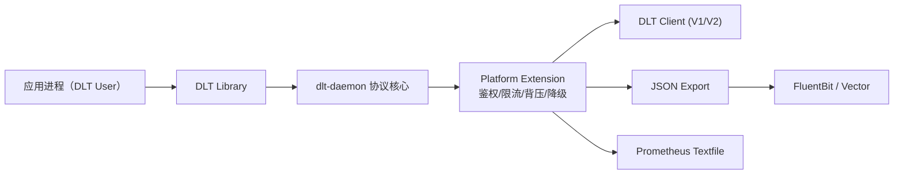
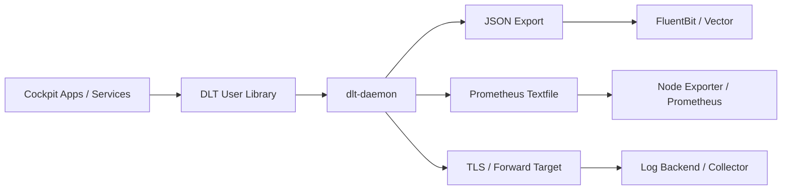

# 车机日志平台 / Cockpit Logging Platform（COVESA DLT 增强工程）

🔥 面向车机与座舱场景的日志平台工程化实现。  
🚀 基于 `COVESA dlt-daemon`，在不破坏 DLT 协议行为的前提下补齐配置化治理、稳定性保护与可运维能力。  
⭐ 覆盖 AUTOSAR DLT V1/V2 兼容回归、控制鉴权、应用级限流、背压保护、JSON 导出、Prometheus 指标、FluentBit/Vector 桥接、ARM/Yocto 交付链路。

<p align="center">
  
  
  
  
</p>

> Status: `active`
>
> Upstream: `COVESA/dlt-daemon`

> **非官方声明（Non-Affiliation）**  
> 本仓库为社区维护的衍生/二次开发版本，与上游项目及其权利主体不存在官方关联、授权背书或从属关系。  
> **商标声明（Trademark Notice）**  
> 相关项目名称、Logo 与商标归其各自权利人所有。本仓库仅用于说明兼容/来源，不主张任何商标权利。
>
> Role: cockpit logging and observability substrate for vehicle software delivery

> **非官方声明（Non-Affiliation）**<br>
> 本仓库是基于 `COVESA/dlt-daemon` 的社区维护衍生工程版，与上游项目、COVESA 及相关权利主体不存在官方关联、授权背书或从属关系。<br>
> **商标声明（Trademark Notice）**<br>
> `COVESA`、`dlt-daemon`、`AUTOSAR DLT` 及相关名称、Logo 与商标归其各自权利人所有；本仓库仅用于说明上游来源、标准兼容与工程化改造边界。

---

## 目录

- [1. 项目定位](#1-项目定位)
- [2. 改造目标与设计原则](#2-改造目标与设计原则)
- [3. 核心能力全景](#3-核心能力全景)
- [4. 架构与模块边界](#4-架构与模块边界)
- [5. 配置体系与参数说明](#5-配置体系与参数说明)
- [6. 构建、运行与部署](#6-构建运行与部署)
- [7. 运维与故障定位流程](#7-运维与故障定位流程)
- [8. 测试、质量与发布门禁](#8-测试质量与发布门禁)
- [9. 交付链路与打包资产](#9-交付链路与打包资产)
- [10. 仓库结构](#10-仓库结构)
- [11. 合规与许可证](#11-合规与许可证)
- [12. 路线图](#12-路线图)
- [13. 发布检查清单](#13-发布检查清单)
- [14. 参考文档](#14-参考文档)
- [15. 常见问题](#15-常见问题)

---

## 1. 项目定位

本仓库将 `dlt-daemon` 定位为“车机日志平台底座”而非单一日志进程。核心目标是：在保持 AUTOSAR DLT 协议语义稳定的前提下，让系统满足车载项目真实落地时对安全、容量、观测、部署和发布治理的要求。

相较于仅具备基础日志收发能力的形态，本项目强调四个工程维度：

1. 协议稳定性：确保 V1/V2 行为一致，不引入协议级破坏性变更。
2. 平台治理性：鉴权、限流、背压、降级均可通过配置启停与调优。
3. 可观测性：支持结构化导出、指标输出、健康检查、故障定位流程。
4. 可交付性：覆盖 CI 门禁、ARM 交叉编译、Yocto 配方和 systemd 部署模板。

适用场景：

- 车机主控日志汇聚与远程采集；
- 多应用并发日志写入导致的资源竞争治理；
- 云边日志链路标准化桥接；
- 需要纳入持续交付体系的车载基础软件组件。

---

## 2. 改造目标与设计原则

### 2.1 改造目标

- 协议兼容优先，不修改 DLT 协议定义与基础行为。
- 优先改造配置层，再接入核心路径，降低回归风险。
- 日志路径、缓存策略、外部转发目标全部参数化。
- 增加控制命令鉴权、应用级配额与限流能力。
- 增加 ring buffer 与 backpressure 策略调优入口。
- 增加 JSON 结构化导出、Prometheus 指标导出与桥接配置。
- 增加异常过载场景的降级策略，保障高峰稳定性。

### 2.2 设计原则

1. 默认行为保持旧语义：新增能力全部为 `opt-in`，默认关闭。
2. 策略逻辑模块化：将治理逻辑放在独立扩展模块，避免污染协议核心。
3. 回归门禁先行：发布前必须通过协议兼容回归。
4. 配置驱动：治理策略通过 `dlt.conf` 控制，不做硬编码绑定。

---

## 3. 核心能力全景

### 3.1 协议与行为兼容

- 保持 DLT V1/V2 编解码语义与常规控制流程；
- 保留原有客户端和应用日志路径；
- 扩展逻辑以挂接方式引入，减少对历史代码路径的侵入。

### 3.2 安全控制

- 控制命令鉴权：`ControlAuthMode`、`ControlAuthAllowlist`；
- 在远程控制场景下限制非法命令来源，降低误操作风险。

### 3.3 稳定性与容量治理

- 应用级速率控制：`AppRateLimitPerSecond`、`AppRateLimitBurst`；
- 背压保护：`BackpressureEnable`、`BackpressureHighWatermark`、`BackpressureHardLimit`；
- 过载降级：`DegradeOnOverload`。

### 3.4 可观测与数据输出

- JSON 结构化导出：`JsonExportEnable`、`JsonExportPath`；
- Prometheus 指标导出：`PrometheusMetricsEnable`、`PrometheusMetricsPath`；
- 对接样例：
  - FluentBit：`deploy/fluent-bit/dlt-json.conf`
  - Vector：`deploy/vector/dlt-vector.toml`

### 3.5 网络与传输

- 外部转发目标配置化：`ForwardTarget`；
- TLS 参数注入：`ForwardTLSEnable`、`ForwardTLSCAFile`、`ForwardTLSCertFile`、`ForwardTLSKeyFile`；
- TLS 参考配置：`deploy/tls/stunnel-dlt-forwarder.conf`。

### 3.6 Adaptor 扩展机制

- 插件化 runner：`src/adaptor/dlt-adaptor-plugin-runner.sh`；
- 插件清单：`src/adaptor/plugins/plugins.conf`；
- 在保留原有 adaptor 兼容性的同时，支持按清单扩展新 adaptor。

---

## 4. 架构与模块边界



分层边界：

- 协议核心层：负责 DLT 标准消息处理与客户端通信；
- 平台扩展层：负责策略治理，不改动协议定义；
- 运维集成层：负责服务部署、健康检查、桥接接入和观测对接。

---

## 5. 配置体系与参数说明

平台扩展参数已在 `src/daemon/dlt.conf` 增加注释模板，采用“默认保守、按需开启”的配置方式。

| 配置项 | 说明 | 默认值 |
|---|---|---|
| `CacheStrategy` | 缓存策略档位 | `legacy` |
| `RingbufferStrategy` | ring buffer 调优策略 | `legacy` |
| `BackpressureEnable` | 背压总开关 | `0` |
| `BackpressureHighWatermark` | 软水位 | `0` |
| `BackpressureHardLimit` | 硬水位 | `0` |
| `BackpressureDropMtinThreshold` | 丢弃阈值 | `4` |
| `DegradeOnOverload` | 过载降级开关 | `0` |
| `AppRateLimitPerSecond` | 应用级限速 | `0` |
| `AppRateLimitBurst` | 应用级突发额度 | `0` |
| `ControlAuthMode` | 控制鉴权模式 | `0` |
| `ControlAuthAllowlist` | 控制鉴权白名单 | 空 |
| `JsonExportEnable` | JSON 导出开关 | `0` |
| `JsonExportPath` | JSON 导出路径 | 空 |
| `PrometheusMetricsEnable` | 指标导出开关 | `0` |
| `PrometheusMetricsPath` | 指标导出路径 | 空 |
| `ForwardTarget` | 外部转发地址 | 空 |
| `ForwardTLSEnable` | TLS 开关 | `0` |
| `ForwardTLS*` | TLS 证书参数 | 空 |
| `BridgeBackend` | 桥接后端 | 空 |
| `BridgeEndpoint` | 桥接目标 | 空 |

---

## 6. 构建、运行与部署

### 6.1 基础构建

```bash
./scripts/install-linux-deps.sh
cmake -S . -B build -DCMAKE_BUILD_TYPE=RelWithDebInfo
cmake --build build -- -j$(nproc)
```

如果只想先检查脚本行为（不实际安装）：

```bash
./scripts/install-linux-deps.sh --dry-run
```

### 6.2 systemd 部署

- 服务模板：`systemd/dlt-platform.service.cmake`
- 健康检查：`scripts/dlt-healthcheck.sh`
- 环境变量样例：`deploy/systemd/platform.env`

### 6.3 典型部署组合

1. 协议核心 + JSON 导出 + FluentBit 聚合；
2. 协议核心 + Prometheus 指标 + Node Exporter Textfile；
3. 协议核心 + 限流背压 + 过载降级；
4. 协议核心 + TLS 转发链路。

### 6.4 常用参数组合示例

灰度阶段建议先观测、后控制，可以按以下顺序推进：

1. 第一阶段：仅开启 `JsonExportEnable` 与 `PrometheusMetricsEnable`；
2. 第二阶段：开启 `ControlAuthMode`，先收紧控制入口；
3. 第三阶段：开启 `AppRateLimitPerSecond` 与 `AppRateLimitBurst`；
4. 第四阶段：启用 `BackpressureEnable` 和降级策略进行高压防护。

示例（仅用于演示）：

```ini
JsonExportEnable=1
JsonExportPath=/var/log/dlt/platform.jsonl
PrometheusMetricsEnable=1
PrometheusMetricsPath=/var/lib/node_exporter/textfile_collector/dlt.prom
ControlAuthMode=1
ControlAuthAllowlist=127.0.0.1,10.0.0.0/24
AppRateLimitPerSecond=2000
AppRateLimitBurst=4000
BackpressureEnable=1
BackpressureHighWatermark=75
BackpressureHardLimit=90
DegradeOnOverload=1
```

### 6.5 平台部署拓扑



---

## 7. 运维与故障定位流程

详细操作说明见 `OPERATIONS.md`。建议排查顺序如下：

1. 执行 `scripts/dlt-healthcheck.sh` 验证服务进程、socket 与端口；
2. 检查平台指标：
   - `dlt_platform_messages_dropped_total`
   - `dlt_platform_messages_dropped_backpressure_total`
   - `dlt_platform_messages_dropped_quota_total`
   - `dlt_platform_control_denied_total`
3. 校验 JSON 导出和桥接链路是否正常写入；
4. 按水位和限流参数调优，必要时启用降级开关；
5. 先恢复稳定性，再逐步细化策略阈值。

---

## 8. 测试、质量与发布门禁

### 8.1 协议兼容回归门禁（核心）

- Workflow：`.github/workflows/protocol-compat-regression.yml`
- 脚本：`scripts/protocol-compat-gate.sh`
- 目标：发布前必须通过 AUTOSAR DLT V1/V2 回归。

### 8.2 工程硬化检查

- `.github/workflows/hardening.yml`
  - `cppcheck` 静态分析
  - `ASan/UBSan` 构建与测试
- `.github/workflows/linux-deps-bootstrap.yml`
  - Linux 依赖安装脚本校验 + 最小构建验证
- `.github/workflows/parser-fuzz.yml`
  - parser fuzz 任务
- `.github/workflows/arm-cross-build.yml`
  - ARM 交叉编译校验

### 8.3 容量基线与回归证据

| 类别 | 建议基线 | 仓库内证据入口 |
|---|---|---|
| 协议兼容 | DLT V1/V2 核心路径可回归 | `tests/gtest_dlt_common*.cpp`, `tests/gtest_dlt_daemon*_v2.cpp` |
| Gateway/转发 | 网关与转发链路可跑通 | `tests/gtest_dlt_daemon_gateway.sh` |
| 离线/文件链路 | 离线日志与文件传输可验证 | `tests/start_filetransfer_test.sh`, `tests/start_logstorage_test.sh` |
| 系统集成 | system logger / journald 路径正常 | `tests/start_system_logger_test.sh`, `tests/start_systemd_journal_test.sh` |
| 运维健康检查 | 基础健康探针返回正常 | `scripts/dlt-healthcheck.sh` |

---

## 9. 交付链路与打包资产

- ARM 交叉编译 Toolchain：`cmake/toolchains/aarch64-linux-gnu.cmake`
- Yocto 层与配方：
  - `yocto/meta-myco/conf/layer.conf`
  - `yocto/meta-myco/recipes-extended/dlt-daemon/dlt-daemon_git.bb`
- systemd 服务模板与部署环境文件：
  - `systemd/dlt-platform.service.cmake`
  - `deploy/systemd/platform.env`

以上资产用于将日志平台能力集成到车载 Linux 镜像与持续交付流水线。

---

## 10. 仓库结构

```text
.
├── src/
│   ├── daemon/
│   └── adaptor/
├── tests/
├── scripts/
├── systemd/
├── deploy/
│   ├── fluent-bit/
│   ├── vector/
│   └── tls/
├── yocto/
├── doc/
├── OPERATIONS.md
└── MPL_SOURCE_OFFER.md
```

---

## 11. 合规与许可证

- 保留原有许可证头注释与 `MPL-2.0` 协议文件；
- 对 MPL 覆盖文件的修改在分发时应提供对应源码；
- 源码提供方式说明见 `MPL_SOURCE_OFFER.md`。

---

## 12. 路线图

- 继续完善 adaptor 插件生命周期管理；
- 增强指标维度与链路追踪能力；
- 扩展协议兼容回归样例覆盖面；
- 持续收敛配置项并沉淀标准部署模板。

---

## 13. 发布检查清单

建议发布前执行以下最小检查集：

1. 协议兼容门禁通过（V1/V2 回归通过）；
2. 核心策略默认关闭验证（确保升级后行为不突变）；
3. JSON 与指标输出链路校验（文件权限、路径可写、消费端可读）；
4. 高压场景压测（验证限流、背压、降级阈值）；
5. systemd 启停与健康检查脚本验证；
6. ARM 交叉构建与目标环境运行验证；
7. MPL 合规文件与源码提供说明完整性检查。

该检查单可以直接作为“协议兼容回归”发布门禁的执行依据。

---

## 14. 参考文档

- 配置手册：`doc/dlt.conf.5.md`
- 运维手册：`OPERATIONS.md`
- 协议兼容门禁脚本：`scripts/protocol-compat-gate.sh`
- 健康检查脚本：`scripts/dlt-healthcheck.sh`
- systemd 模板：`systemd/dlt-platform.service.cmake`
- Yocto 配方：`yocto/meta-myco/recipes-extended/dlt-daemon/dlt-daemon_git.bb`
- 源码提供声明：`MPL_SOURCE_OFFER.md`

---

## 15. 常见问题

### Q1：启用扩展策略会影响协议兼容吗？
不会。扩展策略以旁路治理方式挂接，默认关闭，协议语义保持不变。

### Q2：如何最小化上线风险？
先在灰度环境开启指标与 JSON 导出，仅观察不拦截；再逐步开启限流、背压与降级。

### Q3：发布前最关键的检查是什么？
协议兼容回归门禁。若 V1/V2 回归未通过，不建议发布。

### Q4：如何快速接入日志后端？
优先使用 `deploy/fluent-bit/` 或 `deploy/vector/` 的桥接配置样例。
